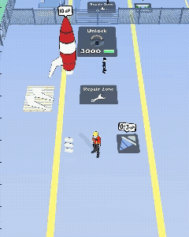
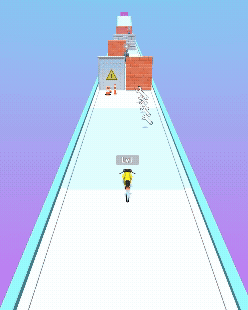

# 💧 About Me:
👋 Hello, I'm Max  I make games with Unity for almost a decade now.

I live for the small details: perfect animation timing, responsive controls, satisfying interactions, fun physics, and that spark of joy when everything just flows. I strongly believe these details are what separate a good game from a great, commercially successful one.

I’m also deeply passionate about ad creatives and CPI campaigns. I enjoy designing and prototyping creatives that clearly communicate fun and achieve strong UA performance.

I even built a prototype tool to test creatives directly in Instagram / TikTok feed context:
👉 https://stopscroll.vercel.app/

## 🌐 Socials:
  
# 💻 Tech Stack:
       

# 🎮 Latest Games:

<table border="0">
<tr>
<td align="center">

 
<a href="https://play.google.com/store/apps/details?id=com.PharsalusGames.SneakyGames"><strong>Sneaky Games on Google Play</strong></a>
 
Bet smart. Play dirty. Win the race. 🏁
 
<b>Role:</b> Lead Developer | UI/UX | Game Feel | Ads
 
<b>Release:</b> Dec 2025
</td>

<td align="center">

 
<a href="https://play.google.com/store/apps/details?id=com.PharsalusGames.PenguinEscape"><strong>Penguin Escape on Google Play</strong></a>
 
Smash obstacles to help a brave penguin reunite with his love! 💑
 
<b>Role:</b> Lead Developer | UI/UX | Game Feel | Ads
 
<b>Release:</b> Sep 2025
</td>
</tr>

<tr>
<td align="center">

 
<a href="https://play.google.com/store/apps/details?id=com.magneticBall3D.app"><strong>Magnetic Ball on Google Play</strong></a>
 
Survivor game built in a custom engine
 
<b>Role:</b> Game Designer | Producer
 
<b>Release:</b> Nov 2024
</td>

<td align="center">

 
<a href="https://github.com/TheMorphy/PlaneMaster3D"><strong>Plane Master Repo</strong></a>
 
Arcade idle game about repairing planes
 
<b>Role:</b> Team Lead | Game Designer | Producer | Ads
 
<b>Release:</b> Oct 2022
</td>
</tr>

<tr>
<td align="center">

 
<a href="https://github.com/TheMorphy/HitAndDrive"><strong>Hit and Drive Repo</strong></a>
 
Hyper casual runner with car evolution
 
<b>Role:</b> Team Lead | Game Designer | Producer | Ads
 
<b>Release:</b> Mar 2022
</td>

<td align="center">

 
<a href="https://github.com/TheMorphy/Stretchy"><strong>Stretchy Repo</strong></a>
 
Hyper casual puzzle
 
<b>Role:</b> Team Lead | Game Designer | Producer | Ads
 
<b>Release:</b> May 2023
</td>
</tr>
</table>

# ✨ Other Projects:

<table border="0">
<tr>
<td align="center">

 
<a href="https://stopscroll.vercel.app/"><strong>StopScroll.ai</strong></a>
 
Future SaaS project designed to help test ad creatives in context
 
<b>Role:</b> CEO
 
<b>Release:</b> TBA
</td>

<td align="center">

</a>
 
<strong>Self Teleportation</strong></a>
 
Unity VR project aimed at helping people connect and   helping people with disabilities
 
<b>Role:</b> Lead Unity Developer
 
<b>Release:</b> TBA
</td>
</tr>
</table>

# 📊 GitHub Stats:
 
